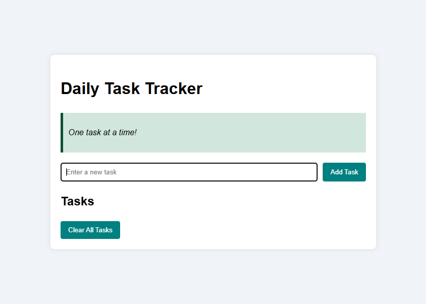

# 📝 Daily Task Tracker  

  
  
  

A simple and responsive **Daily Task Tracker** built with HTML, CSS, and JavaScript.  
This project helps users stay organized by adding, deleting, and saving tasks.  
It also includes a **motivational quote generator** for a daily dose of inspiration.  

---

## 🚀 Features  
- ✅ Add new tasks easily  
- 🗑️ Delete completed tasks  
- 💾 Saves tasks using **Local Storage** (data persists even after refreshing the page)  
- 💡 Motivational quotes for daily inspiration  
- 📱 Responsive design (works on desktop, tablet, and mobile)  

---

## 📂 Project Structure
daily-task-tracker/
│── index.html # Main HTML file
│── style.css # Stylesheet
│── script.js # JavaScript logic
│── screenshot.png # Preview image (optional)
│── README.md # Documentation

---

## ⚙️ Technologies Used  
- **HTML5** – semantic structure  
- **CSS3** – styling and responsiveness  
- **JavaScript (ES6)** – interactivity, DOM manipulation, local storage  

---

## 🌍 Live Demo  
👉 [View on GitHub Pages](https://ayanfe8.github.io/daily-task-tracker/)  

---

## 📸 Screenshots  

Here’s a preview of the **Daily Task Tracker** in action:  

  

---

## 👩‍💻 Author  
Built with ❤️ by **Ayanfe Olapagbo**  
- [GitHub](https://github.com/ayanfe8)   

